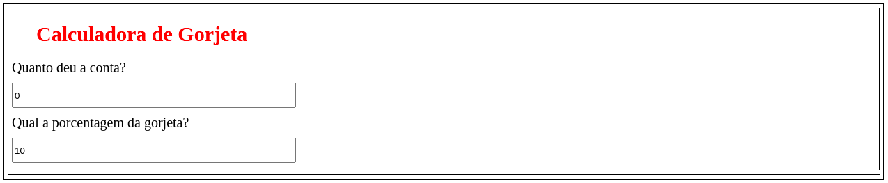

# Projeto Conversor de Moeda.

* Abaixo está a lista das tecnologias que foram usadas no desenvolvimento.

## Styled-components
    * yarn add styled-components --save
* Link para a instalação completa
	* https://medium.com/@jccamargo15/styled-components-instala%C3%A7%C3%A3o-e-configura%C3%A7%C3%A3o-b%C3%A1sica-3a2751a3e83f

# Projeto Calculadora de Gorjeta:

* Projeto para treinamento em reactjs.

* Dentro do <b>README</b> da pasta do projeto está tudo que está sendo usando.
   * https://github.com/thiagoadssilva/calculadoraGorjeta/blob/main/README.md

## <b>Tele Principal</b> 

